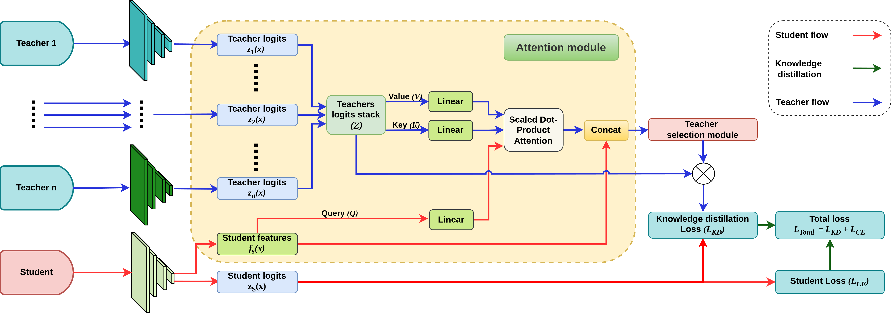

# Context-Aware Teacher Weighting for Robust Knowledge Distillation

This repository contains the official implementation of **ATMLP-KD**, a student-aware distillation model that performs context-guided teacher fusion and sparse selection on a per-sample basis to improve adversarial robustness.

## Table of Contents
1. [Abstract](#abstract)
2. [Installation](#installation)
3. [Usage](#usage)
4. [Datasets](#datasets)
5. [Results](#results)
6. [Citation](#citation)
7. [License](#license)
8. [Contact](#contact)

## Abstract
Multi-teacher knowledge distillation (MTKD) has emerged as an effective strategy for improving the robustness of compact models by leveraging complementary teacher knowledge. However, existing approaches often rely on uniform or weakly adaptive teacher fusion, which can introduce conflicting supervision, especially under adversarial perturbations. To address these issues, this paper proposes a student-aware distillation model that combines a context-aware attention module with adaptive teacher weighting to construct sample-specific teacher targets. An attention module summarizes teacher evidence using intermediate student features, while a lightweight teacher weighting module assigns adaptive weights to emphasize compatible teachers and suppress misleading supervision. Experiments on standard benchmarks show that the proposed method improves both clean accuracy and adversarial robustness. This makes it an efficient and robust alternative to current multi-teacher distillation approaches.


## Installation
### Prerequisites
- Python 3.8+
- PyTorch 1.9.0 or higher
- NVIDIA GPU (recommended for training)
- CUDA 11.6 or higher

### Steps
1. Clone this repository:
   ```bash
   git clone [https://github.com/PhanMinhPhong2422003/ATMLP-KD.git](https://github.com/PhanMinhPhong2422003/ATMLP-KD.git)
   cd ATMLP-KD
   ```
 
2. Install dependencies:
   ```bash
   pip install -r requirements.txt
   ```
   Note: Ensure `requirements.txt` includes dependencies like `torch`, `torchvision`, `numpy`, `thop`, and `torchattacks`. Refer to the file for the complete list.

3. Verify installation:
   ```bash
   python -c "import torch; print(torch.__version__)"
   ```

## Usage
### Setting Up Dataset File Paths

#### Instructions for Setting Up File Paths
- **DATASET_SOURCE**: Defines the path to the dataset directory in the configuration file `config.py`.
   ```python
   data_root = './data/'
   ```
 
- **Directory Structure**: Ensure the dataset is organized in the `data/` directory:
  ```text
  data/
    ├── CIFAR100/
    ├── CIFAR10/
    ├── MNIST/
    └── FashionMNIST/
  ```

### Training
Train the model using the provided configuration:
```bash
# 1. Train the robust teachers (e.g., PGD, FGSM, etc.)
python train_teachers.py

# 2. Train the student via Context-Aware Sparse Distillation
python train_student.py
```

- The `config.py` file contains hyperparameters (e.g., learning rate, epochs). Modify it as needed.
- Training logs and checkpoints will be saved in the root directory.

## Datasets
ATMLP-KD has been validated on the following benchmark datasets:
- **CIFAR-10**
- **Fashion-MNIST**
- **MNIST**

*(Note: The datasets will be automatically downloaded via `torchvision.datasets` during the first run)*.

## Citation
If you use ATMLP-KD in your research, please cite our paper:
```bibtex
@article{,
  title={Context-Aware Teacher Weighting for Robust Knowledge Distillation},
  author={Phan, Minh Phong and Nguyen, Dinh Cong},
  journal={},
  year={2026}
}
```

## License
This project is licensed under the MIT License. See the [LICENSE](LICENSE) file for details.

## Contact
For questions or collaboration, please contact:
- **Author**: Phan Minh Phong, Nguyen Dinh Cong
- **GitHub**: [PhanMinhPhong](https://github.com/PhanMinhPhong2422003)
- **Email**: phongminhphan@gmail.com, nguyendinhcong@hdu.edu.vn
